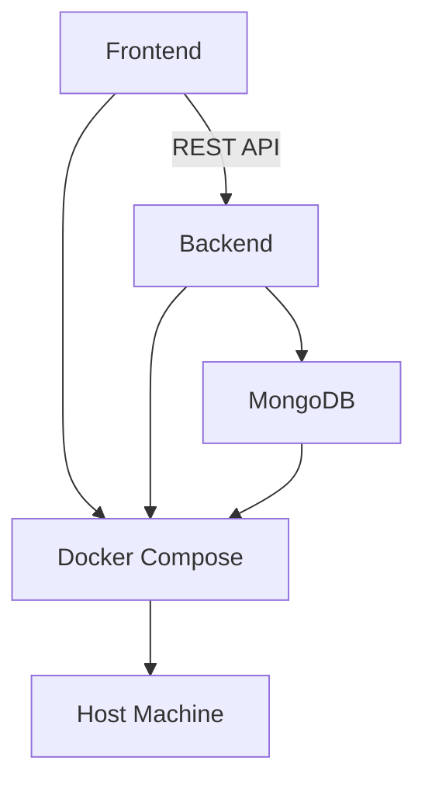

# Meal Planner

Meal Planner is a user-friendly web application designed to assist families in organizing their weekly meals efficiently. The application allows users to plan a weekly menu using recipes from a customizable database. It includes features such as recipe management, filtering, and database cleaning to ensure a smooth and personalized meal planning experience.

## Overview

Meal Planner is built using a microservices architecture to ensure scalability and maintainability. The application comprises the following components:

1. **Frontend**: Developed with React and Vite, providing a dynamic and responsive user interface. It communicates with the backend via RESTful APIs.
2. **Backend**: Built with Node.js and Express, managing API requests, user authentication, and business logic. It interacts with MongoDB using Mongoose.
3. **Database**: MongoDB stores recipe data, user information, and meal plans.
4. **Containerization**: Docker is used to containerize the frontend, backend, and MongoDB services, orchestrated using Docker Compose.



## Features

Meal Planner offers a range of features designed to enhance the meal planning process:

- **Landing Page**: A clean, visually appealing design with a weekly calendar view, responsive layout, and color-coded meal categories.
- **Weekly Meal Display**: Grid layout showing all seven days of the week with recipe details and quick action buttons.
- **Recipe Management**: Upload new recipes via form or JSON file, edit existing recipes, and manually assign recipes to specific days.
- **Filtering System**: Filter recipes by cuisine type, dietary restrictions, preparation time, difficulty, and main ingredient. Save filter preferences for future use.
- **Recipe Database**: Uses MongoDB to store recipes, ensuring no duplicates with a cleaning feature to remove duplicates.
- **Error Handling**: Implements error handling for recipe uploads to ensure data integrity and provides meaningful error messages.
- **Duplicate Detection**: Notifies users of duplicate recipes during uploads and offers options to replace or cancel.
- **Frontend Enhancements**: Dropdown menu for cuisine type filter, checkbox for selecting days to apply filters, and improved layout for user-friendly experience.

## Getting Started

### Requirements

To run the Meal Planner application, the following technologies are required:

- Node.js
- MongoDB (or use a cloud version like MongoDB Atlas)
- Docker (for containerization)

### Quickstart

To set up and run the Meal Planner application, follow these steps:

1. Clone the repository to your local machine.
    ```bash
    git clone https://github.com/yourusername/meal-planner.git
    ```
2. Navigate to the project root directory.
    ```bash
    cd meal-planner
    ```
3. Ensure Docker is installed and running on your system.
    ```bash
    docker --version
    ```
4. Run `docker-compose up` to build and start the application containers.
    ```bash
    docker-compose up
    ```
5. Access the application via your web browser at `http://localhost:9988`.

## License

The project is proprietary. Copyright (c) 2024.